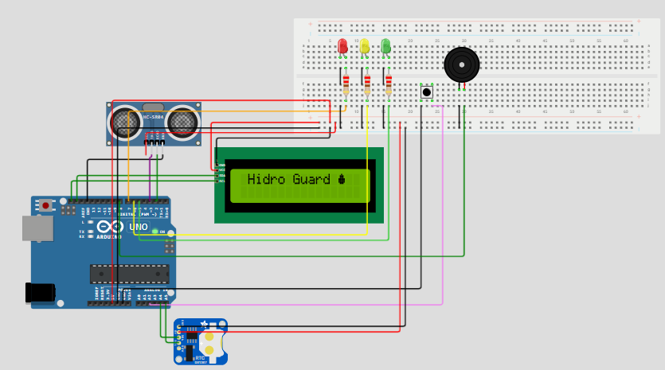

# 💧 Sistema de Alerta de Enchentes com Arduino

Projeto desenvolvido para a disciplina **Edge Computing & IoT** da **Global Solution 2025.1 - FIAP**.

## 🛑 Problema

O aumento do nível da água em áreas urbanas durante chuvas intensas pode causar alagamentos em ruas, casas e estabelecimentos. Muitas comunidades não possuem sistemas de alerta em tempo real, o que compromete a segurança da população.

## ✅ Solução

Criamos um sistema físico de monitoramento que simula o nível da água utilizando um **Sensor de Distância ultrassônico**. O sistema aciona **LEDs indicadores** (verde, amarelo e vermelho) e um **buzzer** de alarme quando o nível atinge valores críticos. O objetivo é alertar localmente a população, permitindo ações preventivas.

## 🔧 Componentes Utilizados

- Arduino Uno | Microcontrolador principal
- Potenciômetro | Simulando sensor de nível
- LEDs: Verde (normal), Amarelo (alerta), Vermelho (crítico)
- Buzzer | Alarme sonoro
- Resistores
- RTC DS1307 | Módulo de relógio de tempo real
- LCD 16x2 I2C | Exibição de dados
- EEPROM interna | Armazenamento de dados 
- Resistores diversos | Para botão e sensores
- Protoboard / Jumpers | Montagem do circuito

## 🧠 Lógica de Funcionamento

| Nível (0 a 1023) | LED Ativo   | Alarme Sonoro |
|------------------|-------------|----------------|
| 0 - 400          | Verde       | Não            |
| 401 - 700        | Amarelo     | Sim (buzzer)   |
| 701 - 1023       | Vermelho    | Sim (buzzer)   |

## ▶️ Demonstração em Vídeo

📽️ [Clique aqui para assistir ao vídeo demonstrativo no YouTube](https://youtu.be/JEAq5olpN-M)  

## 🖥️ Simulação no Wokwi

🚀 [Acesse o projeto funcionando aqui no Wokwi](https://wokwi.com/projects/433017771541274625)

Para testar:
1. Aumente o valor da distância do sensor no simulador.
2. Observe a mudança dos LEDs.
3. Ao atingir os níveis de alerta ou crítico, o buzzer é acionado.

## 🗂️ Como Executar

1. Acesse o link do Wokwi acima.
2. Clique em **Start Simulation**.
3. Interaja com o sensor para simular a elevação da água.
4. Observe o comportamento do sistema.

## 💻 Circuito 

## 📁 Organização do Repositório

- `Global-Solution.ino`: código fonte do Arduino com comentários explicativos.
- `README.md`: este documento explicativo.
- `Circuito`: pasta com imagens do circuito.

## 👨‍💻 Autoria

Projeto desenvolvido por:

- Projeto desenvolvido por **Hidroguard** para a disciplina Edge Computing - FIAP.
- Equipe: Breno Gonçalves Báo e Vinicius Cavalcanti dos Reis
- Professor: Dr. Fábio H. Cabrini

---

Este projeto faz parte da proposta **HidroGuard** da Global Solution FIAP, visando mitigar os impactos das enchentes por meio de soluções tecnológicas acessíveis e escaláveis.
